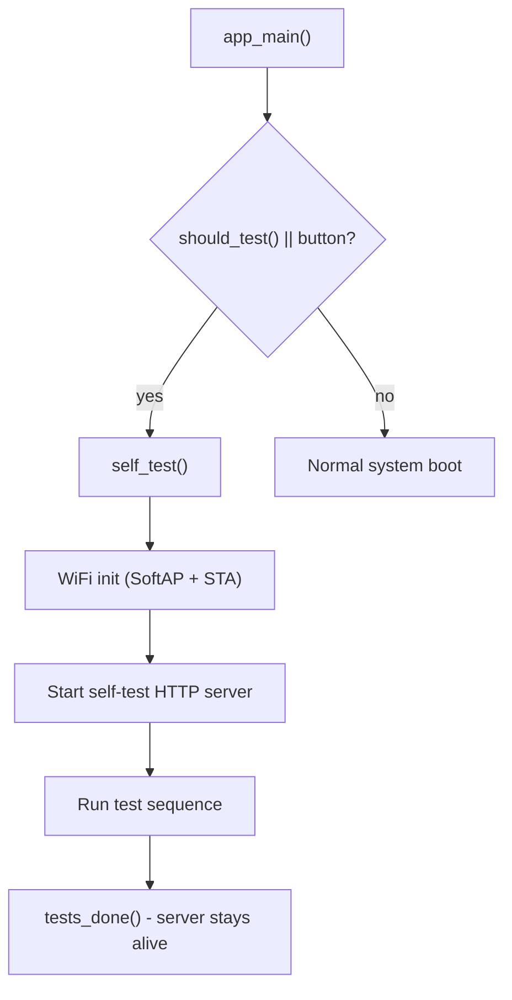
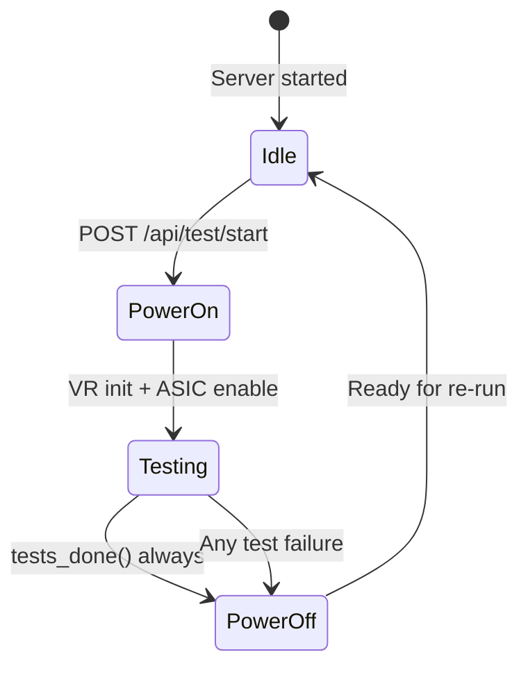

# Self Test HTTP/WebSocket Server

## Architecture Overview

The self-test currently runs in isolation with no network. We will add WiFi initialization and a minimal HTTP+WebSocket server **inside the self_test module**, keeping it fully self-contained. The server starts before the test sequence begins and remains running after completion.



## Key Design Decisions

- **WiFi**: Initialize WiFi inside `self_test()` before tests run. Always start SoftAP; also attempt STA connection to configured WiFi (non-blocking).
- **Server**: Lightweight `esp_http_server` instance with embedded HTML (like [recovery_page.h](main/http_server/recovery_page.h)). No SPIFFS, no build toolchain.
- **WebSocket**: Single `/ws` endpoint pushes real-time status updates (test name, pass/fail, hashrate, temp, voltage) as JSON. The browser accumulates results in a session-local table.
- **Re-run**: A POST endpoint `/api/test/start` triggers a new test sequence. The test loop runs in a dedicated FreeRTOS task so the server remains responsive.
- **Scope**: All new code lives in `main/self_test/`. No changes to the existing `http_server/` module.

## New Files

### 1. `main/self_test/self_test_server.c` - HTTP/WS server implementation

Core responsibilities:

- `self_test_server_start(GlobalState *)` - start httpd, register routes
- `self_test_server_notify(const char *json_msg)` - push status update to connected WS client
- Route handlers:
  - `GET /` - serve embedded HTML page
  - `GET /api/test/status` - JSON snapshot of current test state
  - `POST /api/test/start` - trigger a new test run (creates task)
  - `POST /api/system/restart` - call `esp_restart()`
  - `GET /ws` - WebSocket endpoint for live updates

### 2. `main/self_test/self_test_server.h` - public header

```c
#pragma once
#include "global_state.h"

esp_err_t self_test_server_start(GlobalState *global_state);
void self_test_server_notify_status(const char *test_name,
                                    const char *status,
                                    const char *detail);
```

### 3. `main/self_test/self_test_page.h` - embedded HTML string

A single-page UI with:

- **Status banner**: shows current test step and live log messages (from WS)
- **Buttons**: "Start Test", "Restart Device"
- **Results table**: auto-populated via WebSocket messages, stored in JS memory for that browser session. Columns: Test Name | Status (PASS/FAIL/RUNNING) | Detail (voltage, temp, hashrate, error msg)
- **Styling**: minimal dark theme similar to recovery page, small footprint

### 4. `main/self_test/self_test_wifi.c` - WiFi init for self-test context

Thin wrapper that:

- Calls `esp_netif_init()`, `esp_event_loop_create_default()`
- Starts SoftAP (with generated SSID like normal mode)
- Attempts STA connection to NVS-configured WiFi (non-blocking, timeout-based)
- Returns once AP is up (does not block waiting for STA)

### 5. `main/self_test/self_test_wifi.h` - public header

```c
#pragma once
#include "esp_err.h"

esp_err_t self_test_wifi_init(void);
```

## Power Safety for Re-run Flow

The existing code has a clear power lifecycle: voltage regulator is initialized mid-test and `TPS546_set_vout(0)` is called in `tests_done()`. When re-runs are possible, we must guarantee power is **always** safely managed.

### Power-on sequence (beginning of `run_test_sequence()`)

1. Reset `SELF_TEST_MODULE` state (clear previous results, set `active=true`, `finished=false`)
2. Hardware tests proceed normally — voltage regulator is enabled during `test_voltage_regulator()` which sets `GPIO_ASIC_ENABLE` low and calls `VCORE_init()` + `VCORE_set_voltage()`
3. No change needed here; the existing init flow already handles power-on

### Power-off guarantee (end of every test run, pass or fail)

1. `tests_done()` **always** calls `TPS546_set_vout(0)` first thing — this is already correct
2. For re-run safety, add `GPIO_ASIC_ENABLE` high (disable) alongside `TPS546_set_vout(0)` in `tests_done()` for devices that support it (MAX/ULTRA/SUPRA). Currently only voltage is zeroed but the enable pin is left low.
3. Free the `active_jobs` and `valid_jobs` buffers in `tests_done()` (move the existing `free()` calls into `tests_done()` so they execute on both pass and fail paths, with NULL checks)

### Re-run guard

- `POST /api/test/start` handler checks `SELF_TEST_MODULE.active` — if a test is already running, return HTTP 409 Conflict. Prevents overlapping runs and double power-on.
- The test task sets `active = true` at start, `active = false` at end (in `tests_done()`), providing a reliable mutex-like guard.

### Power state diagram for re-runs



## Changes to Existing Files

### [main/self_test/self_test.c](main/self_test/self_test.c)

- Add WiFi + server startup at the beginning of `self_test()`, after setting `active = true` and creating the semaphore
- Refactor the test sequence into a dedicated function `run_test_sequence(GlobalState *)` that can be called from both the initial flow and the re-run API
- At each test step, call `self_test_server_notify_status()` to push live updates via WebSocket (alongside the existing `display_msg()` calls)
- In `tests_done()`:
  - Keep server alive instead of blocking forever on failure (server loop handles user interaction)
  - Add `gpio_set_level(GPIO_ASIC_ENABLE, 1)` to disable ASIC power for MAX/ULTRA/SUPRA (currently only voltage is zeroed)
  - Move `free(active_jobs)` / `free(valid_jobs)` into `tests_done()` with NULL-guards so cleanup happens on all exit paths
  - Set `SELF_TEST_MODULE.active = false` to allow re-runs
- `run_test_sequence()` must reset module state and NULL-check/re-allocate job buffers at the start of each run

### [main/self_test/self_test.h](main/self_test/self_test.h)

- Expose `run_test_sequence()` so the server can trigger re-runs from its task

### [main/global_state.h](main/global_state.h)

- Expand `SelfTestModule` struct to include per-test result tracking:
```c
typedef struct {
    char name[24];
    bool passed;
    bool completed;
    char detail[48];
} SelfTestResult;

#define SELF_TEST_MAX_RESULTS 12

typedef struct {
    bool active;
    char *message;
    bool result;
    bool finished;
    SelfTestResult results[SELF_TEST_MAX_RESULTS];
    uint8_t result_count;
    float hashrate;
    float temperature;
    uint16_t core_voltage;
} SelfTestModule;
```


### [main/CMakeLists.txt](main/CMakeLists.txt)

- Add new source files to `SRCS`:
  - `"./self_test/self_test_server.c"`
  - `"./self_test/self_test_wifi.c"`

## WebSocket Message Format

Server pushes JSON messages to the browser:

```json
{"type":"status","test":"PSRAM","state":"running","detail":"Testing..."}
{"type":"result","test":"PSRAM","state":"pass","detail":"OK"}
{"type":"result","test":"VCORE","state":"pass","detail":"1150 mV"}
{"type":"result","test":"TEMP","state":"pass","detail":"42.5 C"}
{"type":"result","test":"HASHRATE","state":"running","detail":"HR: 850|V: 1150"}
{"type":"done","passed":true}
```

## Data Flow

```mermaid

sequenceDiagram

participant B as Browser

participant S as HTTP Server

participant T as Test Task

participant HW as Hardware

B->>S: GET / (load page)

S-->>B: Embedded HTML

B->>S: WS /ws (connect)

B->>S: POST /api/test/start

S->>T: Create test task

loop Each test step

T->>HW: Run test

HW-->>T: Result

T->>S: notify_status()

S-->>B: WS JSON message

Note over B: Update table + status

end

T->>S: notify done

S-->>B: WS done message