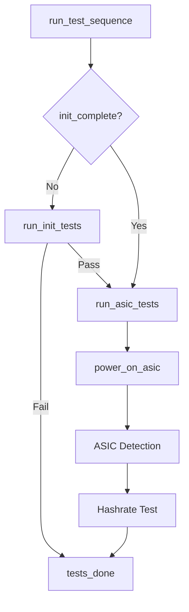

# Separate Init Tests from ASIC Tests

## Current Flow

`run_test_sequence()` runs everything sequentially:

PSRAM -> Peripherals -> VR -> VCORE -> TEMP -> ASIC Detection -> Hashrate

On restart (via `/api/test/start`), `run_test_task` calls `run_test_sequence` again, which re-runs ALL tests including module inits.

## Proposed Architecture

Split into two phases:



**Phase 1 - Init tests** (run once, results preserved across restarts):

- PSRAM
- Peripherals (EMC2101 / INA260)
- Voltage Regulator (full `VCORE_init` + `VCORE_set_voltage` + DS4432U test)
- Core Voltage ADC
- Temperature

**Phase 2 - ASIC tests** (re-run on every restart):

- Power on ASIC (GPIO enable + `VCORE_set_voltage` only -- no `VCORE_init`/`TPS546_init`)
- ASIC Detection (`SERIAL_init` + `init_fn`)
- Hashrate

## File Changes

### 1. [main/global_state.h](main/global_state.h) - Add tracking fields to `SelfTestModule`

Add two fields to the `SelfTestModule` struct:

```c
bool init_complete;       /* true once init tests pass */
uint8_t init_result_count; /* number of results from init phase */
```

### 2. [main/self_test/self_test.c](main/self_test/self_test.c) - Split test logic

**Add `power_on_asic()` function** -- reverse of existing `power_off_asic()`. For MAX/ULTRA/SUPRA: set `GPIO_ASIC_ENABLE` low. Then call `VCORE_set_voltage()` to restore voltage. Does NOT call `VCORE_init()`.

**Extract `run_init_tests()`** -- contains the current PSRAM, Peripherals, VR, VCORE, TEMP test blocks from `run_test_sequence()`. On success, sets `init_complete = true` and records `init_result_count`.

**Extract `run_asic_tests()`** -- calls `power_on_asic()`, then runs the ASIC detection and Hashrate blocks currently in `run_test_sequence()`. Calls `tests_done()` at the end.

**Modify `run_test_sequence()`** to orchestrate:

- Call `reset_test_state()` (aware of init state -- see below)
- If `!init_complete`: call `run_init_tests()`. If it fails, return.
- Call `run_asic_tests()`.

**Modify `reset_test_state()`** -- if `init_complete`, preserve init results: keep `result_count` at `init_result_count`, only clear ASIC result entries, preserve init-phase metrics. If not `init_complete`, full clear as before.

### 3. [main/self_test/self_test.h](main/self_test/self_test.h) - Update docs

Update `run_test_sequence` docstring to reflect the new two-phase behavior (init once, ASIC on every call).

### 4. Documentation

Update or create module documentation in `docs/` for the self-test module reflecting the two-phase test architecture.